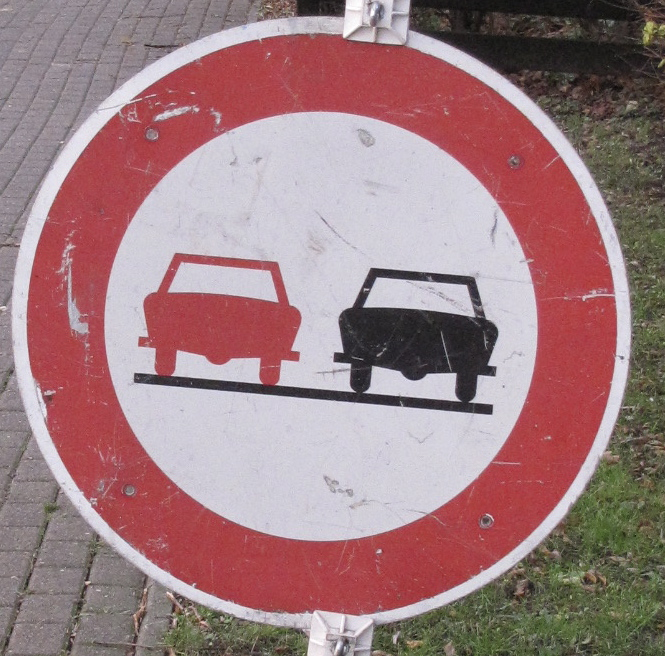
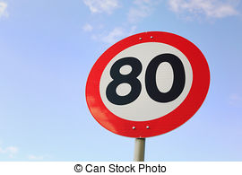
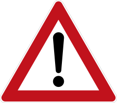

#**Traffic Sign Recognition** 

##Writeup Template

###You can use this file as a template for your writeup if you want to submit it as a markdown file, but feel free to use some other method and submit a pdf if you prefer.

---

**Build a Traffic Sign Recognition Project**

The goals / steps of this project are the following:
* Load the data set (see below for links to the project data set)
* Explore, summarize and visualize the data set
* Design, train and test a model architecture
* Use the model to make predictions on new images
* Analyze the softmax probabilities of the new images
* Summarize the results with a written report

[//]: # (Image References)

[SummaryOfDataSet]: ./Images/WriteUp/Number_of_Samples.png "Number of Samples in each class"
[original]: ./Images/WriteUp/original.png "Original Images"
[preprocessed]: ./Images/WriteUp/preprocessed.png "Preprocessed Images"
[augmented]: ./Images/WriteUp/augmented.png "Augmented Images"
[transformation]: ./Images/WriteUp/transformation.png "Transformed Images"
[class1]: ./Images/WriteUp/class1.png "class1"
[class2]: ./Images/WriteUp/class2.png "class2"
[class3]: ./Images/WriteUp/class3.png "class3"
[class4]: ./Images/WriteUp/class4.png "class4"
[class5]: ./Images/WriteUp/class5.png "class5"

[test1]: ./Images/Test_images/no_passing.jpg "no passing"
[test2]: ./Images/Test_images/right_of_way_at_the_next_intersection.jpg "right_of_way_at_the_next_intersection"
[test3]: ./Images/Test_images/speed_limit_80km.jpg "speed_limit_80km"
[test4]: ./Images/Test_images/yield.jpg "yield"
[test5]: ./Images/Test_images/general_causion.png "general_causion"

## Rubric Points
###Here I will consider the [rubric points](https://review.udacity.com/#!/rubrics/481/view) individually and describe how I addressed each point in my implementation.  

---
## README

I implemented Convolutional Neural Network on German Traffic Sign data set to generalise German traffic signs images and to predict of that. Here is a link to my [project code](https://github.com/liprin1129/Self-Driving-Car/blob/master/Project/4.%20Project2%20(Traffic%20Sign%20Classifier)/Traffic_Sign_Classifier.ipynb)

## Data Set Summary & Exploration

## 1. German Traffic Sign Dataset:

German Traffic Sign dataset have 43 classes/labels of traffic signs consisted of 34799 images for training, 3310 images for validation, and 12630 images for testing the network. Below is representation images and labels of each class.

![alt text][class1]
![alt text][class2]
![alt text][class3]
![alt text][class4]
![alt text][class5]

***Fig1. Images and labels of classes***

I used the pandas library to calculate summary statistics of the traffic signs data set:

* The size of training set is 34799 with the 32 pixels for width and 32 pixels for height. Because the training set are colour image, an colour image is comprised of 3 channels of 32x32 pixels for red, green, and blue colour respectively. Therefore, training set has the 4D shape of (34799, 32, 32, 3).
* The size of the validation set is 3310, and it was used for generalisation to have high performance. This is also comprised of colour images, therefore the shape of it is (3310, 32, 32, 3).
* The size of test set is 12630 colour images. This also have the same width and height as the training images and validation images, and the shape of the test set is (12630, 32, 32, 3) accordingly.
* There are 43 classes in the data sets, and each class contains different number of images. 

The chart below is the summary of the number of images contained in each unique class of training dataset.

| File | Number of Images | Shape |
|:---------------------:|:--:|:--:| 
| Train | 34799 | 32x32x3 RGB image |
| Validation | 3310 | 32x32x3 RGB image |
| Test | 12630 | 32x32x3 RGB image |
|||
|||

***Table 1. Information of input images***

## 2. Preprocessing And Ballacing The dataset

Sometimes some images are not distinguishable. They look dark and black, because constrast of them is low. The example is like below.

![alt text][original]

***Fig 2. Low contrast images.***

Training the dataset containing the low constrast images with LeNet model results in 0.907 accuracy in maximum. This results does not match the criteria (over 0.93 accuracy), thus, preprocessing those sample images is necessary. 

Firstly, I changed the scale of images from RGB channels into one channel (gray scale) in order that classification of grayscale images will have higher accuracy than RGB images.
<!---Using grayscale images for object recognition with convolutional-recursive neural network)--> Then, histogram of those gray scaled images were streched to the either sides, using OpenCV function, _cv2.equalizeHist(img)_. Finally, the enhaced contrast images were normalised to have ranges from 0 to 1. Below is the result of the three steps (converting gray scale -> equlising histogram -> normalising).

![alt text][preprocessed]

***Fig3. Enhanced contrast***

Another problem that the traffic sign dataset has is the number of images in each class are biased. In other words, some classes have more samples than others. 

![alt text][SummaryOfDataSet]

***Fig4. Number of Samples in each class***

As a result, if we train the medel using the dataset, it may try to predict the favor of the one side. Therefore it is necessary to balance the number of sample images in each class. Thus, I balanced the number of images in each unique class. Because augmenting same images will just give computational load when I train a model, I augmented images in classes by adding transformed images which already exist in the classes until all classes have same number of samples as in a maximum class. For the transformation, I varied the size of images, rotated them, and implemented affain transformation.

The result of transformation is like below,
![alt text][transformation]

***Fig5. Transformed Images***

and all unique classes equally have 2010 samples.

![alt text][augmented]

***Fig6. Number of Augmented Samples in each class***

<!--- Describe how you preprocessed the image data. What techniques were chosen and why did you choose these techniques? Consider including images showing the output of each preprocessing technique. Pre-processing refers to techniques such as converting to grayscale, normalization, etc. (OPTIONAL: As described in the "Stand Out Suggestions" part of the rubric, if you generated additional data for training, describe why you decided to generate additional data, how you generated the data, and provide example images of the additional data. Then describe the characteristics of the augmented training set like number of images in the set, number of images for each class, etc.)-->

## 3. Model Architecture

<!-- ####2. Describe what your final model architecture looks like including model type, layers, layer sizes, connectivity, etc.) Consider including a diagram and/or table describing the final model. -->

My final model consisted of the following layers:

| Layer         		|     Description	        					             | 
|:---------------------:|:----------------------------------------------------------:| 
| Input         		| 32x32x1 Grayscale image						             | 
| Convolution 3x3     	| 1x1 stride, valid padding, outputs 30x30x6 	             |
| RELU					|												             |
| Convolution 3x3      	| 1x1 stride, valid padding, outputs 28x28x16	             |
| RELU					|												             |
| Max Pooling 2x2       | 2x2 stride, valid padding, outputs 14x14x16                |
| Inception Model	    | Covolution 1x1, same padding, output 14x14x6               |
|                  	    | Covolution 3x3, same padding, output 14x14x16              |
|                  	    | Covolution 5x5, same padding, output 14x14x32              |
|                  	    | Max Pooling 3x3, 1x1 stride, same padding, output 14x14x32 |
|                  	    | Covolution 1x1, same padding, output 14x14x6               |
|                  	    | output 14x14x60                                            |
| Dropout               | 0.5 probability                                            |
| Convolution 5x5      	| 1x1 stride, valid padding, outputs 14x14x60	             |
| RELU					|												             |
| Dropout               | 0.7 probability                                            |
| Max Pooling 3x3       | 3x3 stride, outputs 3x3x230                                |
| Fully connected		| outputs 1700 									             |
| RELU					|												             |
| Dropout               | 0.5 probability                                            |
| Fully connected		| outputs 800 									             |
| RELU					|												             |
| Dropout               | 0.5 probability                                            |
| Fully connected		| outputs 43 									             |
| Softmax				|           									             |
||
||

***Table2. Chosen model architecture***
<!-- ####3. Describe how you trained your model. The discussion can include the type of optimizer, the batch size, number of epochs and any hyperparameters such as learning rate.-->

To train the model, I minimised Cross Entropy, and used an Adam Optimizer with a batch size, 128, 30 epoches, and 0.001 learning rate.

<!-- ####4. Describe the approach taken for finding a solution and getting the validation set accuracy to be at least 0.93. Include in the discussion the results on the training, validation and test sets and where in the code these were calculated. Your approach may have been an iterative process, in which case, outline the steps you took to get to the final solution and why you chose those steps. Perhaps your solution involved an already well known implementation or architecture. In this case, discuss why you think the architecture is suitable for the current problem.-->

The final model results were:
* training set accuracy of 
* validation set accuracy of 
* test set accuracy of ?

To get the best validation set accuracy, I compared 5 architectures varying colour of input dataset and pre-process tasks.

* Architectures 1

| Layer         		|     Description	        					             | 
|:---------------------:|:----------------------------------------------------------:| 
| Input         		| 32x32x? Grayscale image						             | 
| Convolution 5x5     	| 1x1 stride, valid padding, outputs 28x28x6 	             |
| RELU					|												             |
| Max Pooling 2x2       | 2x2 stride, valid padding, outputs 14x14x6                 |
| Convolution 5x5      	| 1x1 stride, valid padding, outputs 10x10x16	             |
| RELU					|												             |
| Max Pooling 2x2       | 2x2 stride, valid padding, outputs 5x5x16                  |
| Fully connected		| outputs 120									             |
| RELU					|												             |
| Fully connected		| outputs 84 									             |
| RELU					|												             |
| Fully connected		| outputs 43 									             |

* Architecture 2

| Layer         		|     Description	        					             | 
|:---------------------:|:----------------------------------------------------------:| 
| Input         		| 32x32x? Grayscale image						             | 
| Convolution 5x5     	| 1x1 stride, valid padding, outputs 28x28x32 	             |
| RELU					|												             |
| Dropout				| 0.9 probability								             |
| Convolution 5x5      	| 1x1 stride, valid padding, outputs 24x24x64	             |
| RELU					|												             |
| Dropout				| 0.8 probability								             |
| Max Pooling 2x2       | 2x2 stride, valid padding, outputs 12x12x64                |
| Convolution 5x5      	| 1x1 stride, valid padding, outputs 8x8x128	             |
| RELU					|												             |
| Dropout				| 0.7 probability								             |
| Max Pooling 2x2       | 2x2 stride, valid padding, outputs 4x4x128                 |
| Fully connected		| outputs 1024  								             |
| RELU					|												             |
| Dropout				| 0.6 probability								             |
| Fully connected		| outputs 512 									             |
| RELU					|												             |
| Dropout				| 0.5 probability								             |
| Fully connected		| outputs 43 									             |

* Architecture 3

| Layer         		|     Description	        					             | 
|:---------------------:|:----------------------------------------------------------:| 
| Input         		| 32x32x? Grayscale image						             | 
| Convolution 5x5     	| 1x1 stride, valid padding, outputs 28x28x128 	             |
| RELU					|												             |
| Droupout              | 0.5 probability                                            |
| Convolution 5x5      	| 1x1 stride, valid padding, outputs 24x24x256	             |
| RELU					|												             |
| Max Pooling 2x2       | 2x2 stride, valid padding, outputs 12x12x256               |
| Convolution 5x5      	| 1x1 stride, valid padding, outputs 8x8x384	             |
| RELU					|												             |
| Max Pooling 2x2       | 2x2 stride, valid padding, outputs 4x4x384                 |
| Fully connected		| outputs 3072  								             |
| RELU					|												             |
| Fully connected		| outputs 1536 									             |
| RELU					|												             |
| Fully connected		| outputs 43 									             |

* Architecture 4 : Described as the final model

* Architecture 5

| Layer         		|     Description	        					             | 
|:---------------------:|:----------------------------------------------------------:| 
| Input         		| 32x32x? Grayscale image						             | 
| Convolution 3x3     	| 1x1 stride, valid padding, outputs 30x30x6 	             |
| RELU					|												             |
| Convolution 3x3      	| 1x1 stride, valid padding, outputs 28x28x16	             |
| RELU					|												             |
| Max Pooling 2x2       | 2x2 stride, valid padding, outputs 14x14x16                |
| Inception Model	    | Covolution 1x1, same padding, output 14x14x16              |
|                  	    | Covolution 3x3, same padding, output 14x14x32              |
|                  	    | Covolution 5x5, same padding, output 14x14x64              |
|                  	    | Max Pooling 3x3, 1x1 stride, same padding, output 14x14x16 |
|                  	    | Covolution 1x1, same padding, output 14x14x12              |
|                  	    | output 14x14x124                                           |
| RELU					|												             |
| Dropout               | 0.5 probability                                            |
| Convolution 3x3      	| 1x1 stride, valid padding, outputs 12x12x64	             |
| Inception Model	    | Covolution 1x1, same padding, output 12x12x128             |
|                  	    | Covolution 3x3, same padding, output 12x12x230             |
|                  	    | Covolution 5x5, same padding, output 12x12x230             |
|                  	    | Max Pooling 3x3, 1x1 stride, same padding, output 12x12x64 |
|                  	    | Covolution 1x1, same padding, output 12x12x12              |
|                  	    | output 12x12x124                                           |
| RELU					|												             |
| Dropout               | 0.5 probability                                            |
| Max Pooling 3x3       | 3x3 stride, valid padding, outputs 4x4x600                 |
| Convolution 1x1      	| 1x1 stride, valid padding, outputs 4x4x130	             |
| Fully connected		| outputs 1200 									             |
| RELU					|												             |
| Dropout               | 0.6 probability                                            |
| Fully connected		| outputs 430 									             |
| RELU					|												             |
| Dropout               | 0.5 probability                                            |
| Fully connected		| outputs 43 									             |

* Pree-process tasks

| No.   | Colour    | Sharpening   | Brighten | Normalisation     | Tool      | Transformation    |
|:-:|:-:|:-:|:-:|:-:|:-:|:-:|
| 1 | Gray | X | X | O | OpenCV | O |
| 2 | Gray | O | O | O | OpenCV | O |
| 3 | Gray | O | O | O | Scikit image and PIL | O |
| 4 | Gray | O | O | O | Self | O |
| 5 | Colour | X | X | O | Self | O |
| 6 | Colour | O | O | O | OpenCV | O |
| 7 | Colour | O | O | O | Scikit image and PIL | O |
| 8 | Colour | O | O | O | Self | O |

***Table 3.Pre-processing tasks***

Firstly, I used LeNet model architecture to train pre-processed gray scale images as a start point. It had ??? validation accuracy on number 1 task in the above table. Then I increased depths of each layer with different dropout parameters on each layers, but not changed filter shapes. In this time, it had ??? validation accuracy. Next, I increased depths of each convolutional layers and added dropout with 0.5 probability, because dropout can solve the overfitting problem in this high depths of layers. Also I does not change the shape of filters. This model architecture had ??? accuracy on trainig dataset and ??? on validation dataset, which means under fitting. Increasing depth more than 32 had underfitting problem, so I stop to increase depths of each layer, and changed the basic model architecture, Inception Model.

To use inception model, I put 1x1 convolutional layer before an inception layer. After the inception layer, I set dropout with 0.5 probability to prevent overfitting problem. This task is explained in table 1. Finally, I put one more inception model to the network and check a validation accuracy.

I implemented these 5 model architectures on 8 cases of the pre-processed dataset. Therefore, I compared 40 cases in total. Below is the table for this 40 cases.

|Pre-processed Number|Model Architecture|Training Accuracy|Validation Accuracy| Test Accuracy| Run Time|
|:-:|:-:|:-:|:-:|:-:|:-:|
|1|Model 1| 0.992 | 0.857 | 0.841 | 8min 51s  |
| |Model 2| 0.992 | 0.935 | 0.912 | 23min 39s |
| |Model 3| 0.025 | 0.021 | 0.024 | ??        |
| |Model 4| 0.993 | 0.947 | 0.920 | 34min 57s |
| |Model 5| 0.979 | 0.937 | 0.908 | 46min 43s |
||||
|2|Model 1| 0.984 | 0.814 | 0.360 | 7min 56s  |
| |Model 2| 0.984 | 0.912 | 0.413 | 24min 22s |
| |Model 3| 0.024 | 0.024 | 0.023 | ??        |
| |Model 4| 0.982 | 0.920 | 0.424 | 28min 56s |
| |Model 5| 0.959 | 0.905 | 0,405 | 46min 42s |
||||
|3|Model 1| 0.985 | 0.819 | 0.375 | 9min 19s  |
| |Model 2| 0.987 | 0.927 | 0.414 | 23min 40s |
| |Model 3| | |
| |Model 4| 0.987 | 0.928 | 0.423 | 29min 21s |
| |Model 5| 0.969 | 0.924 | 0.419 | 46min 45s |
||||
|4|Model 1| |  |
| |Model 2| | |
| |Model 3| | |
| |Model 4| 0.969 | 0.899 | 0.887 | 47min 19s |
| |Model 5| | |
||||
|5|Model 1| | |
| |Model 2| | |
| |Model 3| | |
| |Model 4| 
| |Model 5| | |
||||
|6|Model 1| 0.802 | 0.789 | 0.734 | 12min 32s |
| |Model 2| 0.988 | 0.936 | 0.902 | 28min 46s |
| |Model 3| 0.025 | 0.023 | 0.024 | ??        |
| |Model 4| 0.964 | 0.909 | 0.890 | 47min 12s |
| |Model 5| 0.945 | 0.895 | 0.814 | 1h 18min  |
||||
|7|Model 1| | 0.794 |
| |Model 2| | |
| |Model 3| | |
| |Model 4| 0.976 | 0.926 | 0.905 | 47min 6s |
| |Model 5| | |
||||
|8|Model 1| | 0.758 |
| |Model 2| | |
| |Model 3| | |
| |Model 4| 
| |Model 5| | |
||||
||||

***Table 4. Comparison among different colour and model Architecture***

In conclusion for these comparison tasks, training and validation accuracy is influenced by both conditions of pre-processed images and of model architecture. Grayscale image with normalisation and augmentation using OpenCV library had higher validation accuracy than others pre-processing tasks. Therefore, it is assumed that grayscale image has higher classification accuracy than colour images due to the advantage of reduced computational cost. In addition, among different model architectures, inception model represented in table 2 was the highest validation accuracy.

<!--* If an iterative approach was chosen:
 What was the first architecture that was tried and why was it chosen?
* What were some problems with the initial architecture?
* How was the architecture adjusted and why was it adjusted? Typical adjustments could include choosing a different model architecture, adding or taking away layers (pooling, dropout, convolution, etc), using an activation function or changing the activation function. One common justification for adjusting an architecture would be due to overfitting or underfitting. A high accuracy on the training set but low accuracy on the validation set indicates over fitting; a low accuracy on both sets indicates under fitting.
* Which parameters were tuned? How were they adjusted and why?
* What are some of the important design choices and why were they chosen? For example, why might a convolution layer work well with this problem? How might a dropout layer help with creating a successful model?-->

<!--
If a well known architecture was chosen:
* What architecture was chosen?
* Why did you believe it would be relevant to the traffic sign application?
* How does the final model's accuracy on the training, validation and test set provide evidence that the model is working well?
-->

## 4. Test a Model on New Images

<!--#### 1. Choose five German traffic signs found on the web and provide them in the report. For each image, discuss what quality or qualities might be difficult to classify.-->

Here are five German traffic signs that I found on the web:

***Fig7. 5 test images found on the web***

The first image (no passing sign) and the last image (general causionsign) might be difficult to classify, because in pre-processing task, augmented images doen not include resize images, and in the two test images, traffic sign occupy almost all spaces of their images.

####2. Discuss the model's predictions on these new traffic signs and compare the results to predicting on the test set. At a minimum, discuss what the predictions were, the accuracy on these new predictions, and compare the accuracy to the accuracy on the test set (OPTIONAL: Discuss the results in more detail as described in the "Stand Out Suggestions" part of the rubric).

Here are the results of the prediction:

| Image			        |     Prediction	        					| 
|:---------------------:|:---------------------------------------------:| 
| No passing      		| Stop sign   									| 
| U right of way at the next intersection | U-turn					|
| Speed limit 80km/h	| Yield											|
| Yeild	      	    	| Bumpy Road					 				|
| General causion		| Slippery Road      							|

The model was able to correctly guess ? of the 5 traffic signs, which gives an accuracy of ??%. This compares favorably to the accuracy on the test set of ...

####3. Describe how certain the model is when predicting on each of the five new images by looking at the softmax probabilities for each prediction. Provide the top 5 softmax probabilities for each image along with the sign type of each probability. (OPTIONAL: as described in the "Stand Out Suggestions" part of the rubric, visualizations can also be provided such as bar charts)

The code for making predictions on my final model is located in the 11th cell of the Ipython notebook.

For the first image, the model is relatively sure that this is a stop sign (probability of 0.6), and the image does contain a stop sign. The top five soft max probabilities were

| Probability         	|     Prediction	        					| 
|:---------------------:|:---------------------------------------------:| 
| .60         			| Stop sign   									| 
| .20     				| U-turn 										|
| .05					| Yield											|
| .04	      			| Bumpy Road					 				|
| .01				    | Slippery Road      							|

For the second image ... 

### (Optional) Visualizing the Neural Network (See Step 4 of the Ipython notebook for more details)
####1. Discuss the visual output of your trained network's feature maps. What characteristics did the neural network use to make classifications?

