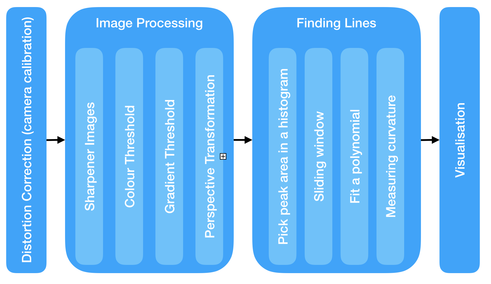

## Writeup Template

---

**Advanced Lane Finding Project**

The goals / steps of this project are the following:

* Compute the camera calibration matrix and distortion coefficients given a set of chessboard images.
* Apply a distortion correction to raw images.
* Use color transforms, gradients, etc., to create a thresholded binary image.
* Apply a perspective transform to rectify binary image ("birds-eye view").
* Detect lane pixels and fit to find the lane boundary.
* Determine the curvature of the lane and vehicle position with respect to center.
* Warp the detected lane boundaries back onto the original image.
* Output visual display of the lane boundaries and numerical estimation of lane curvature and vehicle position.

[//]: # (Image References)

[image1]: ./examples/undistort_output.png "Undistorted"
[image2]: ./test_images/test1.jpg "Road Transformed"
[image3]: ./examples/binary_combo_example.jpg "Binary Example"
[image4]: ./examples/warped_straight_lines.jpg "Warp Example"
[image5]: ./examples/color_fit_lines.jpg "Fit Visual"
[image6]: ./examples/example_output.jpg "Output"
[video1]: ./project_video.mp4 "Video"

## [Rubric](https://review.udacity.com/#!/rubrics/571/view) Points

# Pipeline (single images)

I follow the pipeline as below. First I get camera calibration coefficient to undistort images/frames, then apply image processing. Next, I did some techniques to find lane lines. Finally, I visualise detected lane lines on images/frames. This is simply illustrated as below.



1. Distortion Correction (Camera Calibration)

To correct a distortion of images, I implemented `camera calibration` on chessborad. Didistortions occur when 3D objects are transformed on a 2D image. For exmaple, `radial distortion` makes lines or objects appear more or less curved than their actual appearance in 3D space. `tangential distortion` affects that some objects appear farther away or closer than they actually are. Therefore, distiortion on 2D images has to be managed properly to get rid of it on images.

For this, I used chessboard images on which I compute the distance between a point in a chessboard (objpoints) and the centre of the image which does not change through the transformation from 3D objects to 2D image. What to be noted is that I do not know the actual size of the chessboard as well as the distance between balck and white grids, I simply pass the points as (0,0), (1,0), (2,0), ... to objpoints, which denote the location of points. I used only (x, y) coordinates information for object points, assuming a plane on the chessboard has a fixed z coordinate (z = 0) and moves on a xy plane. Then, I compare the difference between the actual distance and the distance on an distorted image. After that, I aquire coefficients (k1, k2, k3, p1, p2) needed to correct for the distortions. This is process under the equations as below.

- Radial distortion correction


- Tangential distortion correction


To demonstrate this step, I will describe how I apply the distortion correction to chessboard images.

 Images below is distorted chessboard images,

 

and these are corrected images.


# Image Processing

To detect lane lines in an image/frame, I perform some image processing tasks to creat a thresholded binary image. The processing tasks are largely seperated into four parts; intensity sharpening, colour transform, gradient method, perspective transform. Then I combine all those tasks together and make an binary image/fram.

These are original test iamges befor image processing.


Firstly, I sharpen intensity of an image, because after sharpening images I can get clearer colour intensities in pixels. 

- Sharpen Images (left is original imagrs, and right is the images after sharpening)


Next, I used colour transorms to detect lane lines which are normally long yellow line or white dotted line. For this, hsv, hls, Lab, colour spaces were applied.

#### 1. Provide an example of a distortion-corrected image.

To demonstrate this step, I will describe how I apply the distortion correction to one of the test images like this one:
![alt text][image2]

#### 2. Describe how (and identify where in your code) you used color transforms, gradients or other methods to create a thresholded binary image.  Provide an example of a binary image result.

I used a combination of color and gradient thresholds to generate a binary image (thresholding steps at lines # through # in `another_file.py`).  Here's an example of my output for this step.  (note: this is not actually from one of the test images)

![alt text][image3]

#### 3. Describe how (and identify where in your code) you performed a perspective transform and provide an example of a transformed image.

The code for my perspective transform includes a function called `warper()`, which appears in lines 1 through 8 in the file `example.py` (output_images/examples/example.py) (or, for example, in the 3rd code cell of the IPython notebook).  The `warper()` function takes as inputs an image (`img`), as well as source (`src`) and destination (`dst`) points.  I chose the hardcode the source and destination points in the following manner:

```python
src = np.float32(
    [[(img_size[0] / 2) - 55, img_size[1] / 2 + 100],
    [((img_size[0] / 6) - 10), img_size[1]],
    [(img_size[0] * 5 / 6) + 60, img_size[1]],
    [(img_size[0] / 2 + 55), img_size[1] / 2 + 100]])
dst = np.float32(
    [[(img_size[0] / 4), 0],
    [(img_size[0] / 4), img_size[1]],
    [(img_size[0] * 3 / 4), img_size[1]],
    [(img_size[0] * 3 / 4), 0]])
```

This resulted in the following source and destination points:

| Source        | Destination   | 
|:-------------:|:-------------:| 
| 585, 460      | 320, 0        | 
| 203, 720      | 320, 720      |
| 1127, 720     | 960, 720      |
| 695, 460      | 960, 0        |

I verified that my perspective transform was working as expected by drawing the `src` and `dst` points onto a test image and its warped counterpart to verify that the lines appear parallel in the warped image.

![alt text][image4]

#### 4. Describe how (and identify where in your code) you identified lane-line pixels and fit their positions with a polynomial?

Then I did some other stuff and fit my lane lines with a 2nd order polynomial kinda like this:

![alt text][image5]

#### 5. Describe how (and identify where in your code) you calculated the radius of curvature of the lane and the position of the vehicle with respect to center.

I did this in lines # through # in my code in `my_other_file.py`

#### 6. Provide an example image of your result plotted back down onto the road such that the lane area is identified clearly.

I implemented this step in lines # through # in my code in `yet_another_file.py` in the function `map_lane()`.  Here is an example of my result on a test image:

![alt text][image6]

---

### Pipeline (video)

#### 1. Provide a link to your final video output.  Your pipeline should perform reasonably well on the entire project video (wobbly lines are ok but no catastrophic failures that would cause the car to drive off the road!).

Here's a [link to my video result](./project_video.mp4)

---

### Discussion

#### 1. Briefly discuss any problems / issues you faced in your implementation of this project.  Where will your pipeline likely fail?  What could you do to make it more robust?

Here I'll talk about the approach I took, what techniques I used, what worked and why, where the pipeline might fail and how I might improve it if I were going to pursue this project further.  
